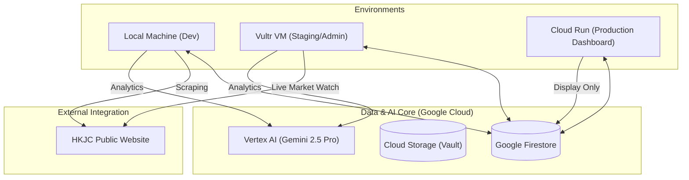
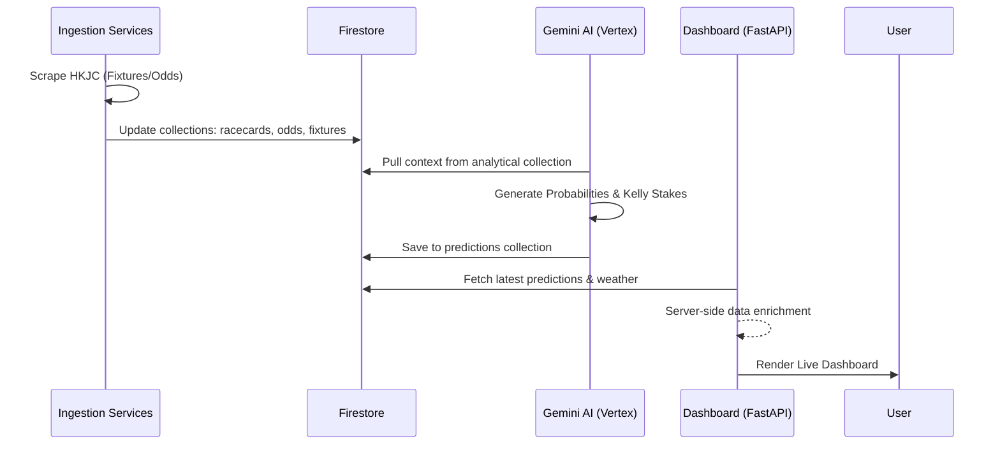

# HKJC Prediction System - Architecture & Components

This document provides a comprehensive overview of the HKJC V2 prediction system, detailing the technical architecture, infrastructure, and data workflows.

## 1. High-Level Architecture

The system is designed as a multi-environment architecture that shares a common data core (Firestore) and AI brain (Gemini).

## 2. Infrastructure Components

### 🖥️ Compute Layers
*   **Local (Asus PC)**: Primary hub for heavy data processing, backtesting, and development.
*   **Vultr VM (`45.32.255.155`)**: The "Engine Room." Runs the 24/7 background `MarketWatchdog` and `DailyRunner`. It acts as the **Real-Time Data Producer**, syncing live odds and alerts directly to Firestore.
*   **Google Cloud Run**: The "Public Showroom." A production-grade dashboard that pulls data from Firestore. It provides a scalable, fast interface for the public at `hkjc-v2.web.app`.

### 🗄️ Storage & Data Management
*   **Google Firestore**: The single source of truth. All predictions, odds, and track conditions are synced here to ensure consistency across Local, VM, and Cloud environments.
*   **Google Cloud Storage (GCS)**: Used as a "Vault" for large analytical exports and model tuning datasets.
*   **Local JSON Cache**: Found in `data/`, used for performance and offline development to reduce Firestore read costs.

### 🧠 AI Engine
*   **Gemini 2.5 Pro**: The core reasoning engine.
*   **Vertex AI (us-central1)**: Hosts the Gemini endpoints and manages context caching for large historical datasets.

## 3. Core Data Flow

## 4. Key Service Components (in `/services`)

| Component | Responsibility |
| :--- | :--- |
| `prediction_engine.py` | Orchestrates the Gemini prompts and multi-agent reasoning logic. |
| `firestore_service.py` | Handles all CRUD operations with Google Cloud Firestore. |
| `market_watchdog.py` | Monitors live odds fluctuations for "Smart Money" detection. |
| `execution_engine.py` | Uses Playwright to automate bet slips on the HKJC website. |
| `weathernext_client.py`| Integrates specialized weather data from the `weathernext_pro` project. |
| `rl_optimizer.py` | Reinforcement learning loop that adjusts prediction biases based on past results. |

## 5. Deployment Relationships

*   **Continuous Sync**: Git (GitHub) syncs code, while Firestore syncs data.
*   **Failover**: If Cloud Run is unreachable, the VM-hosted dashboard serves as a reliable fallback.
*   **Live Betting**: The VM is the primary executor for live betting due to its stable uptime and static IP.
